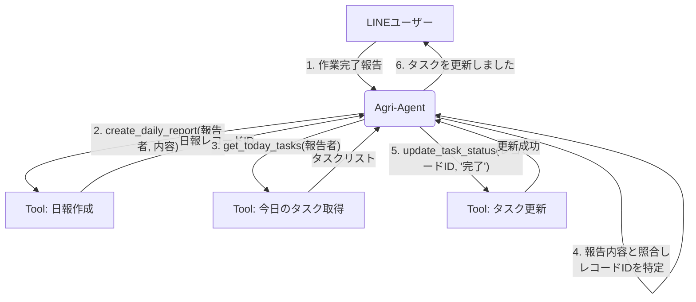

# 課題: 自然言語によるタスク更新の実現

## 1. 直面する問題

本アプリケーションの核心的な課題は、LINEなどの対話インターフェースから送られてくる自然言語の報告（例：「今日の消毒作業、終わりました」）を、どのようにしてAirtable上の具体的なデータベース操作（例：特定のタスクレコードのステータスを「完了」に更新）に結びつけるか、という点にある。

LINEユーザーは、以下のような情報を持っていない。
- 更新すべきAirtableのテーブル名
- 更新対象の具体的な **レコードID** (`rec...` から始まる一意のID)
- 更新すべきフィールドの正確な名前（例：「ステータス」）

このため、単純なツール（例：`update_task_status(record_id, status)`）だけでは、ユーザーの意図を汲んだ処理を実現できない。

## 2. 解決アプローチ: エージェントによる思考とツール連携

この問題は、単一のツールを改良するのではなく、**エージェント自身が複数のツールを連続して呼び出し、思考する**ことで解決する。エージェントは「オーケストレーター」として振る舞い、自然言語とデータベースの間のギャップを埋める。

ユーザーからの「作業完了」報告を受けたエージェントの思考プロセスは以下の通りである。

1.  **報告の受付と記録:**
    -   まず、報告内容を失わないように `create_daily_report` ツールで「日報ログ」に記録する。

2.  **コンテキストの収集とタスクの特定:**
    -   「誰の」「いつの」タスクかを特定するため、報告者名と今日の日付を基に `get_today_tasks` ツールで候補となるタスクリストを取得する。

3.  **レコードIDの抽出:**
    -   取得したタスクリストと、ユーザーの報告内容（例：「消毒作業」）を照らし合わせ、最も合致するタスクを特定し、そのタスクの **レコードID** を抽出する。

4.  **具体的な操作の実行:**
    -   特定したレコードIDを使い、`update_task_status` ツールを呼び出して、タスクのステータスを「完了」に更新する。

5.  **ユーザーへのフィードバック:**
    -   全ての処理が完了したことをユーザーに分かりやすく報告する。

## 3. ワークフロー図

この一連の流れを可視化すると以下のようになる。

このように、個々のツールはシンプルで再利用可能な部品として実装し、それらを組み合わせる複雑なロジックはエージェントが担う。このアーキテクチャこそが、本アプリケーションの柔軟性と拡張性を支える基盤となる。 